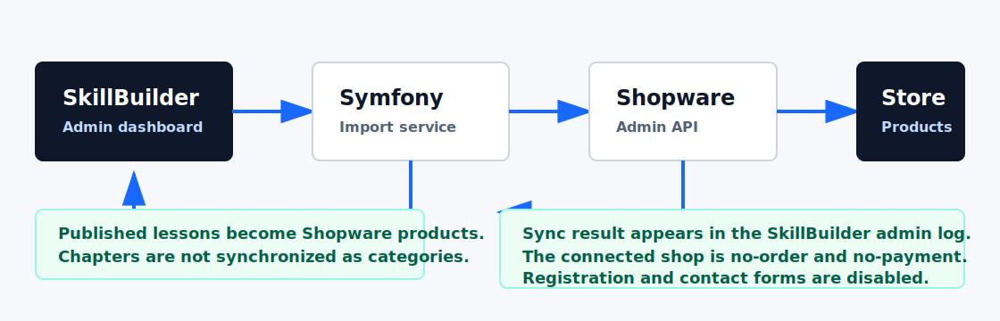

# SkillBuilder

Portfolio evidence for **SkillBuilder**, a private Symfony-based learning platform built, deployed, and maintained as a practical backend project.

**Recruiter summary:** Symfony learning platform with role-based workflows, learning logic, GDPR-oriented features, deployment evidence, and a real Shopware Admin API bridge. Published SkillBuilder lessons can be synchronized as Shopware products through an admin workflow.

**Positioning:** PHP / Symfony backend development, business applications, data-driven workflows, application support, and API-based e-commerce integration.

**Core proof:** Development, deployment, and operation of a Symfony learning platform with Doctrine, Twig, MariaDB, role-based workflows, learning logic, GDPR export, tests, and a real Shopware Admin API bridge.

This repository intentionally does **not** contain the private application source code. It contains a product case study, architecture notes, selected anonymized examples, screenshots, and quality evidence that can be shared with employers or clients.

## Why This Repository Exists

The real SkillBuilder application contains private implementation details, deployment configuration, and product-specific code. For public portfolio use, this repository presents:

- what the product does
- which technical problems were solved
- how the architecture is structured
- how quality was verified
- small representative code examples that are safe to publish

## Live Demo

Demo URL: `https://sb.mcmonaco.de`

Demo credentials are not published in this repository. They can be provided during an interview or live walkthrough.

Connected Shopware demo repository: [roadynet/shopware-demo-shop](https://github.com/roadynet/shopware-demo-shop)

## What I Built

- Symfony learning platform with login, roles, lessons, questions, progress tracking, learning settings, statistics, and admin workflows
- Service-oriented backend logic for scheduling, question selection, progress calculation, imports, and GDPR export
- Admin-only Shopware bridge that synchronizes published SkillBuilder lessons as Shopware products
- Deployment and operation on a live web server
- Public showcase with screenshots, architecture notes, test evidence, and safe code examples

## Quick Facts

| Bereich | Inhalt |
| --- | --- |
| Hauptprojekt | Symfony-Lernplattform SkillBuilder |
| Live-Demo | `https://sb.mcmonaco.de` |
| Backend-Fokus | PHP 8.4, Symfony 8, Doctrine, Twig, MariaDB, Rollen, Services, Tests |
| Shopware-Bruecke | Admin-Button synchronisiert veroeffentlichte Lessons ueber die Shopware Admin API als Produkte |
| Mapping | Lessons werden Produkte. Kapitel werden nicht als Kategorien synchronisiert. |
| Shop-Kategorie | Produkte werden gesammelt der Shop-Kategorie `SkillBuilder Kurse` zugeordnet |
| Demo-Schutz im Shop | Keine echten Bestellungen, keine Zahlung, keine Registrierung, kein Kontaktformular, keine personenbezogenen Shop-Daten |

## Project Summary

SkillBuilder is a learning platform built with PHP/Symfony. It combines structured lessons, adaptive question practice, progress tracking, personal learning settings, admin workflows, GDPR-oriented export features, production deployment, and a real Shopware Admin API synchronization workflow.

## Practical Development Since 2023

After completing the IHK qualification, SkillBuilder became the main practical project for deepening modern PHP/Symfony development. The work covers architecture, implementation, debugging, deployment, database work, tests, UI polish, and integration with a real Shopware installation.

This is the project used to demonstrate current hands-on practice in Symfony backend development and connected business software.

Core product areas:

- role-based login for users, teachers, and admins
- lesson dashboard with onboarding
- reading, testing, and mistake-review flows
- adaptive learning scheduler
- user-specific learning settings
- learning statistics and reporting
- admin question editing
- Shopware Admin API bridge for synchronizing published lessons into Shopware products, documented in the connected [Shopware demo repository](https://github.com/roadynet/shopware-demo-shop)
- user and role management
- GDPR data export workflow
- PHPUnit tests for core learning behavior

## Tech Stack

- PHP 8.4
- Symfony 8
- Doctrine ORM
- Twig
- MySQL/MariaDB
- PHPUnit
- Composer
- Git/GitHub
- shared-hosting deployment
- Shopware 6 integration basics
- Shopware Admin API product synchronization

## Shopware Integration Architecture



Only published SkillBuilder lessons are synchronized as Shopware products. Draft or archived lessons stay out of the storefront or are deactivated during sync. Lesson chapters are not synchronized as Shopware categories.

## What Is Included

- [Case study](docs/case-study.md)
- [Architecture overview](docs/architecture.md)
- [Quality and test report](docs/quality-report.md)
- [Interview summary](docs/interview-summary.md)
- [Recruiter project summary](docs/project-summary-for-recruiters.md)
- [Demo checklist](docs/demo-checklist.md)
- [Code walkthrough](docs/code-walkthrough.md)
- [Shopware bridge](docs/shopware-bridge.md)
- [Representative examples](examples/)

Representative code examples:

- [Learning scheduler](examples/learning-scheduler/LearningSchedulerExample.php)
- [Section code parser](examples/section-code/SectionCodeServiceExample.php)
- [Next due question selection](examples/question-selection/NextDueQuestionServiceExample.php)
- [Security role check](examples/security/RoleCheckExample.php)
- [Example tests](examples/tests/)

## Screenshots


## What Is Not Included

This repository does not include:

- production application source code
- database credentials
- `.env` files
- private deployment scripts
- user data
- full business logic
- generated exports or uploads

## Test Evidence

The private codebase currently has:

```text
PHPUnit 12.5.4
Runtime: PHP 8.4.21

14 tests
650 assertions
OK
```

Additional checks performed:

- PHP syntax check across 180 files
- Twig lint across 38 templates
- YAML lint across 18 config files
- Symfony container lint
- Doctrine mapping validation
- router checks
- live smoke checks for public and protected routes

## Portfolio Positioning

SkillBuilder demonstrates product-focused Symfony development: domain modeling, service-layer architecture, role-based access, privacy-aware workflows, testable learning logic, UI polish, production operations, and API-based e-commerce integration.
