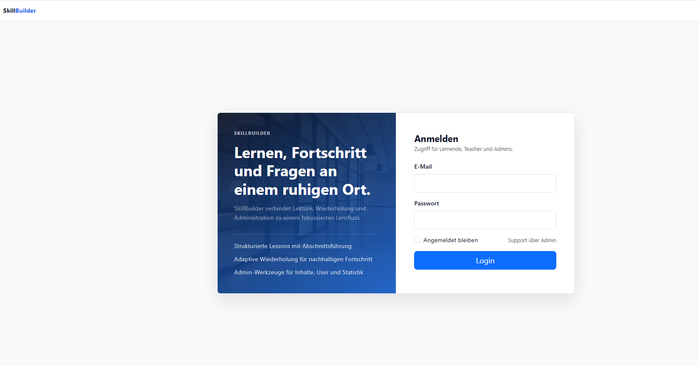
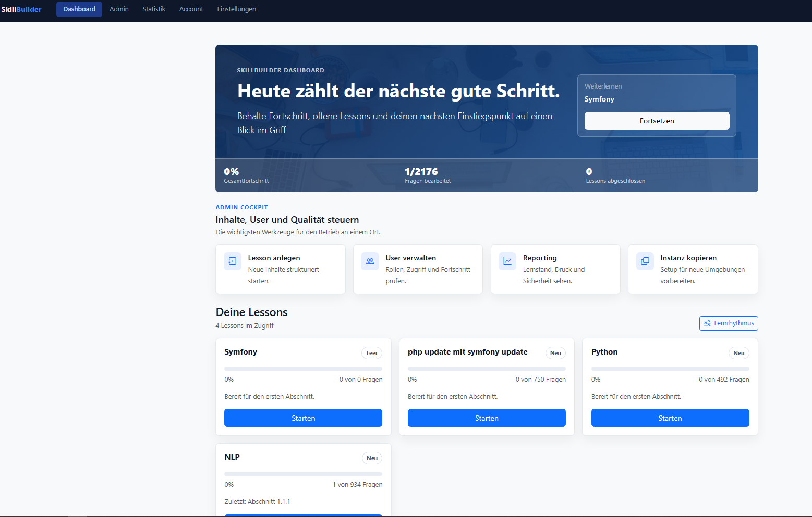
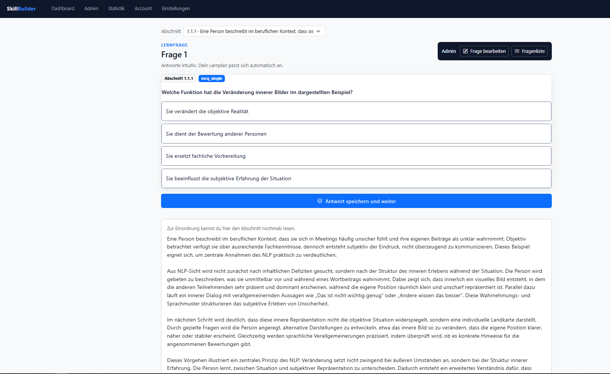
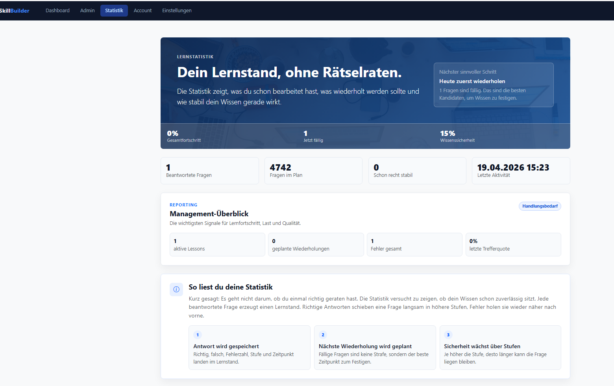
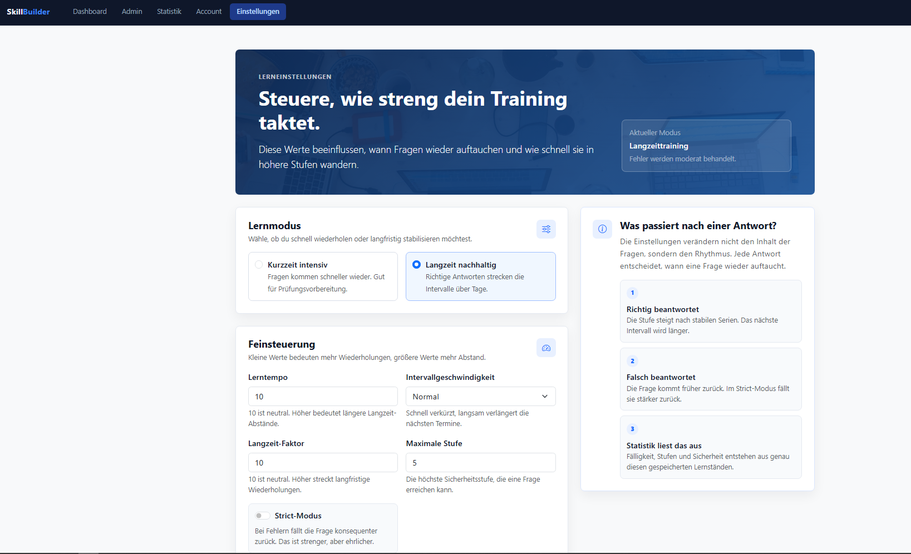
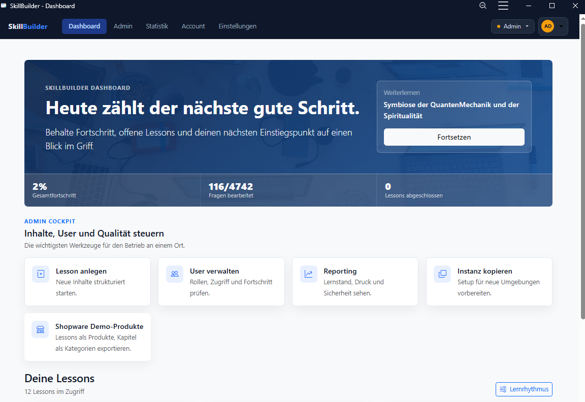

# SkillBuilder Showcase

Public portfolio repository for **SkillBuilder**, a private Symfony-based learning platform.

This repository intentionally does **not** contain the production source code. It contains a product case study, architecture notes, selected anonymized examples, screenshots, and quality evidence that can be shared with employers or clients.

## Why This Repository Exists

The real SkillBuilder application contains private implementation details, deployment configuration, and product-specific code. For public portfolio use, this showcase repository presents:

- what the product does
- which technical problems were solved
- how the architecture is structured
- how quality was verified
- small representative code examples that are safe to publish

## Live Demo

Demo URL: `https://sb.mcmonaco.de`

Demo credentials are not published in this repository. They can be provided during an interview or live walkthrough.

## Project Summary

SkillBuilder is a learning platform built with PHP/Symfony. It combines structured lessons, adaptive question practice, progress tracking, personal learning settings, admin workflows, GDPR-oriented export features, and production deployment.

Core product areas:

- role-based login for users, teachers, and admins
- lesson dashboard with onboarding
- reading, testing, and mistake-review flows
- adaptive learning scheduler
- user-specific learning settings
- learning statistics and reporting
- admin question editing
- user and role management
- GDPR data export workflow
- PHPUnit tests for core learning behavior

## Tech Stack

- PHP 8.4
- Symfony 8
- Doctrine ORM
- Twig
- MySQL/MariaDB
- PHPUnit
- Composer
- Git/GitHub
- shared-hosting deployment

## What Is Included

- [Case study](docs/case-study.md)
- [Architecture overview](docs/architecture.md)
- [Quality and test report](docs/quality-report.md)
- [Interview summary](docs/interview-summary.md)
- [Demo checklist](docs/demo-checklist.md)
- [Code walkthrough](docs/code-walkthrough.md)
- [Representative examples](examples/)

Representative code examples:

- [Learning scheduler](examples/learning-scheduler/LearningSchedulerExample.php)
- [Section code parser](examples/section-code/SectionCodeServiceExample.php)
- [Next due question selection](examples/question-selection/NextDueQuestionServiceExample.php)
- [Security role check](examples/security/RoleCheckExample.php)
- [Example tests](examples/tests/)

## Screenshots













## What Is Not Included

This repository does not include:

- production application source code
- database credentials
- `.env` files
- private deployment scripts
- user data
- full business logic
- generated exports or uploads

## Test Evidence

The private codebase currently has:

```text
PHPUnit 12.5.4
Runtime: PHP 8.4.21

14 tests
650 assertions
OK
```

Additional checks performed:

- PHP syntax check across 180 files
- Twig lint across 38 templates
- YAML lint across 18 config files
- Symfony container lint
- Doctrine mapping validation
- router checks
- live smoke checks for public and protected routes

## Portfolio Positioning

SkillBuilder demonstrates product-focused Symfony development: domain modeling, service-layer architecture, role-based access, privacy-aware workflows, testable learning logic, UI polish, and production operations.
