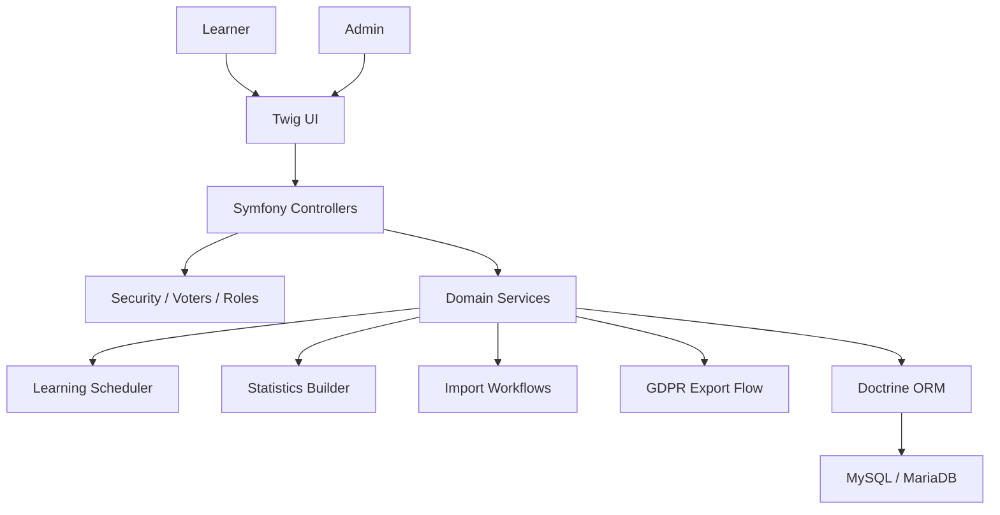

# Architecture Overview

SkillBuilder follows a backend-driven Symfony architecture. Controllers handle HTTP concerns, while domain decisions live in services.

## Key Domains

- `Lesson`: top-level learning unit
- `LessonSection`: structured content section
- `CourseQuestion`: question assigned to a lesson or section
- `CourseQuestionOption`: answer option for multiple choice
- `CourseQuestionProgress`: user-specific learning state
- `UserLearningSettings`: rhythm and scheduling preferences
- `GdprExportRequest`: user data export request

## Service Layer

Representative service responsibilities:

- schedule the next review after an answer
- select due questions
- calculate progress and stability
- import structured content
- export user data with the correct request owner
- log sensitive GDPR access

## Security Model

The private application uses:

- authenticated sessions
- role-based access for users, teachers, and admins
- explicit admin-only routes
- access checks before sensitive workflows
- safe GDPR export ownership

