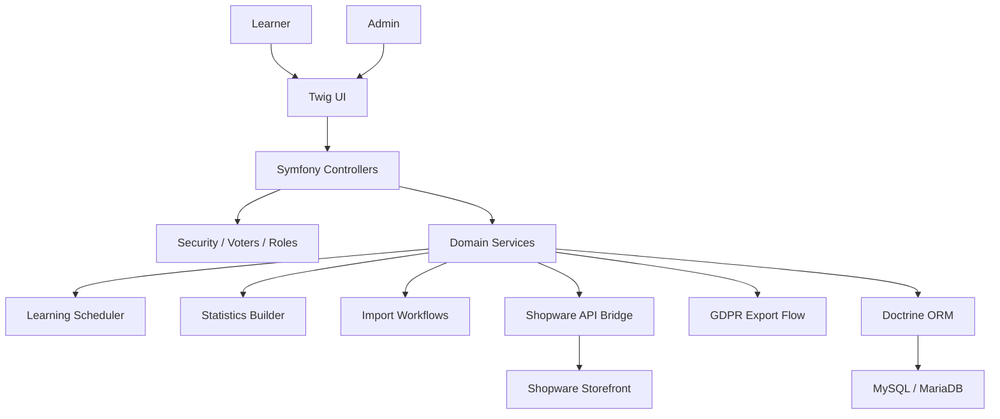
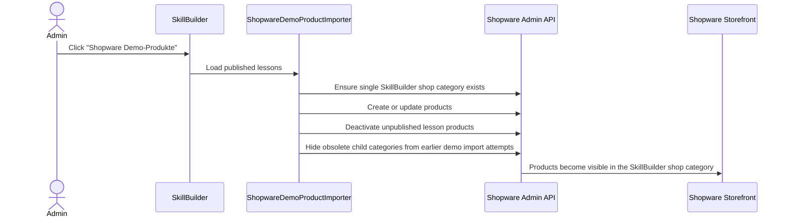

# Architecture Overview

SkillBuilder follows a backend-driven Symfony architecture. Controllers handle HTTP concerns, while domain decisions live in services.



## Key Domains

- `Lesson`: top-level learning unit
- `LessonSection`: structured content section
- `CourseQuestion`: question assigned to a lesson or section
- `CourseQuestionOption`: answer option for multiple choice
- `CourseQuestionProgress`: user-specific learning state
- `UserLearningSettings`: rhythm and scheduling preferences
- `GdprExportRequest`: user data export request

## Service Layer

Representative service responsibilities:

- schedule the next review after an answer
- select due questions
- calculate progress and stability
- import structured content
- synchronize published lessons to Shopware products
- export user data with the correct request owner
- log sensitive GDPR access

## Review Notes For Senior Symfony Readers

The important design boundary is that controllers do not own learning policy. They collect HTTP input, enforce route-level concerns, and hand off to services that can be tested without a browser session or database fixture.

The private application uses Doctrine for persistence, but the public examples intentionally keep core policies in plain PHP. That makes the business rules easy to inspect:

- scheduling changes are expressed as state transitions
- due-question selection has deterministic ordering
- section-code parsing normalizes imported filenames before they become navigation or filtering keys
- security examples describe the authorization boundary instead of hiding it inside UI behavior

The expected Symfony shape is:

```text
Route / Controller / Form / CSRF
-> Security role or voter decision
-> Domain service
-> Doctrine repository or external API client
-> Twig or redirect response
```

This keeps production behavior explainable when debugging cache, wiring, permission, or deployment issues.

## Shopware Demo Bridge

The portfolio demo includes an admin-only integration path:



Mapping:

- Published lesson becomes a Shopware product
- Products are assigned to the `SkillBuilder Kurse` shop category
- Lesson chapters are not synchronized as Shopware categories
- Product numbers use a stable `SB-COURSE-*` format
- Repeated imports update existing products instead of duplicating them
- Unpublished lessons are removed from storefront visibility
- Sync results are shown in the SkillBuilder admin log and status card

## Security Model

The private application uses:

- authenticated sessions
- role-based access for users, teachers, and admins
- explicit admin-only routes
- access checks before sensitive workflows
- safe GDPR export ownership
- server-side external API credentials
- security headers on live public routes
- public/private repository separation for portfolio safety
