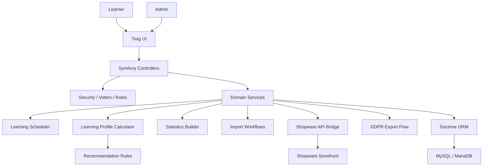
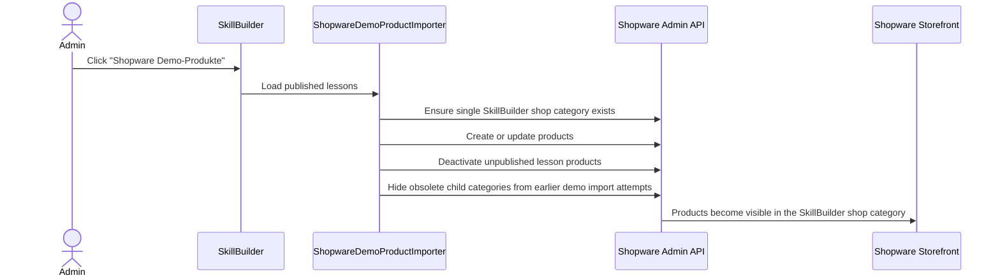

# Architecture Overview

SkillBuilder follows a backend-driven Symfony architecture. Controllers handle HTTP concerns, while domain decisions live in services.

## Key Domains

- `Lesson`: top-level learning unit
- `LessonSection`: structured content section
- `CourseQuestion`: question assigned to a lesson or section
- `CourseQuestionOption`: answer option for multiple choice
- `CourseQuestionProgress`: user-specific learning state
- `UserLearningSettings`: rhythm and scheduling preferences
- `LearningProfile`: profile result for learning type, pace, repetition need, and task preference
- `LearningTypeQuestion` / `LearningTypeAnswer`: questionnaire data for the profile flow
- `GdprExportRequest`: user data export request

## Service Layer

Representative service responsibilities:

- schedule the next review after an answer
- calculate learning profiles from weighted questionnaire answers
- turn profile results into lesson recommendations and learning settings
- select due questions
- calculate progress and stability
- import structured content
- synchronize published lessons to Shopware products
- export user data with the correct request owner
- log sensitive GDPR access

## Shopware Demo Bridge

The portfolio demo includes an admin-only integration path:

Mapping:

- Published lesson becomes a Shopware product
- Products are assigned to the `SkillBuilder Kurse` shop category
- Lesson chapters are not synchronized as Shopware categories
- Product numbers use a stable `SB-COURSE-*` format
- Repeated imports update existing products instead of duplicating them
- Unpublished lessons are removed from storefront visibility
- Sync results are shown in the SkillBuilder admin log and status card

## Security Model

The private application uses:

- authenticated sessions
- role-based access for users, teachers, and admins
- explicit admin-only routes
- access checks before sensitive workflows
- login throttling for repeated failed authentication attempts
- runtime host/header guard coverage
- safe GDPR export ownership
