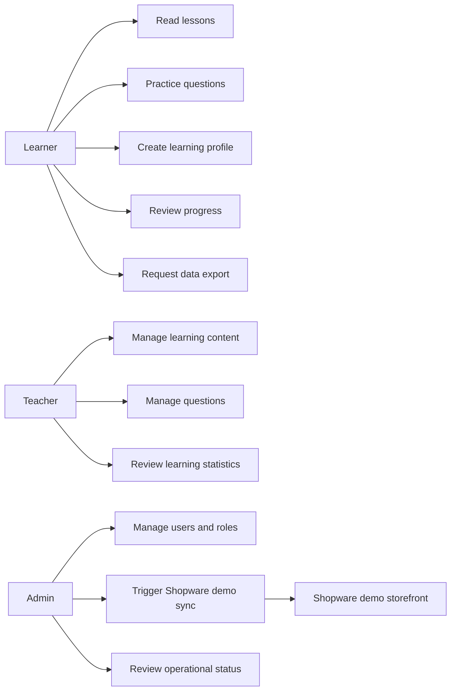
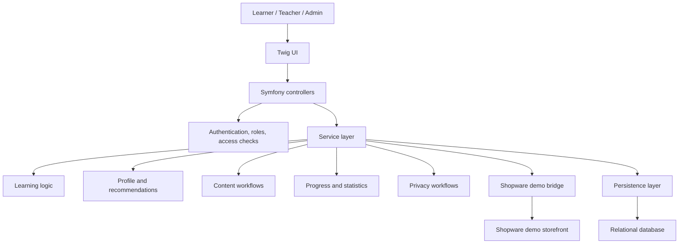
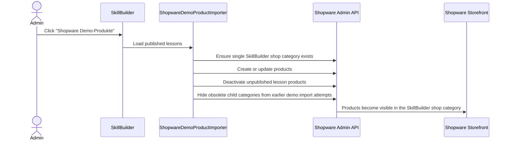

# Architecture Overview

SkillBuilder follows a backend-driven Symfony architecture. Controllers handle HTTP concerns, while domain decisions live in services.

This public overview is intentionally abstract. The private codebase, exact entity fields, production configuration, security internals, deployment details, credentials, and user data are not published.

## Public Use-Case View

## Public System View

## Public Domain Areas

- learning content and section navigation
- questions, answers, scheduling, and repetition
- learning profile and recommendation rules
- user roles, admin workflows, and reporting
- GDPR-oriented data export workflow
- Shopware demo synchronization for published lessons

## Service Layer

Representative service responsibilities:

- schedule the next review after an answer
- calculate learning profiles from weighted questionnaire-style answers
- turn profile results into recommendations and learning settings
- select due questions
- calculate progress and stability
- import structured content
- synchronize published lessons to Shopware products
- export user data with the correct request owner
- log sensitive GDPR access

## Shopware Demo Bridge

The portfolio demo includes an admin-only integration path:

Mapping:

- Published lesson becomes a Shopware product
- Products are assigned to the `SkillBuilder Kurse` shop category
- Lesson chapters are not synchronized as Shopware categories
- Product numbers use a stable `SB-COURSE-*` format
- Repeated imports update existing products instead of duplicating them
- Unpublished lessons are removed from storefront visibility
- Sync results are shown in the SkillBuilder admin log and status card

## Security Model

The private application uses:

- authenticated sessions
- role-based access for users, teachers, and admins
- explicit admin-only routes
- access checks before sensitive workflows
- login throttling for repeated failed authentication attempts
- runtime host/header guard coverage
- safe GDPR export ownership
